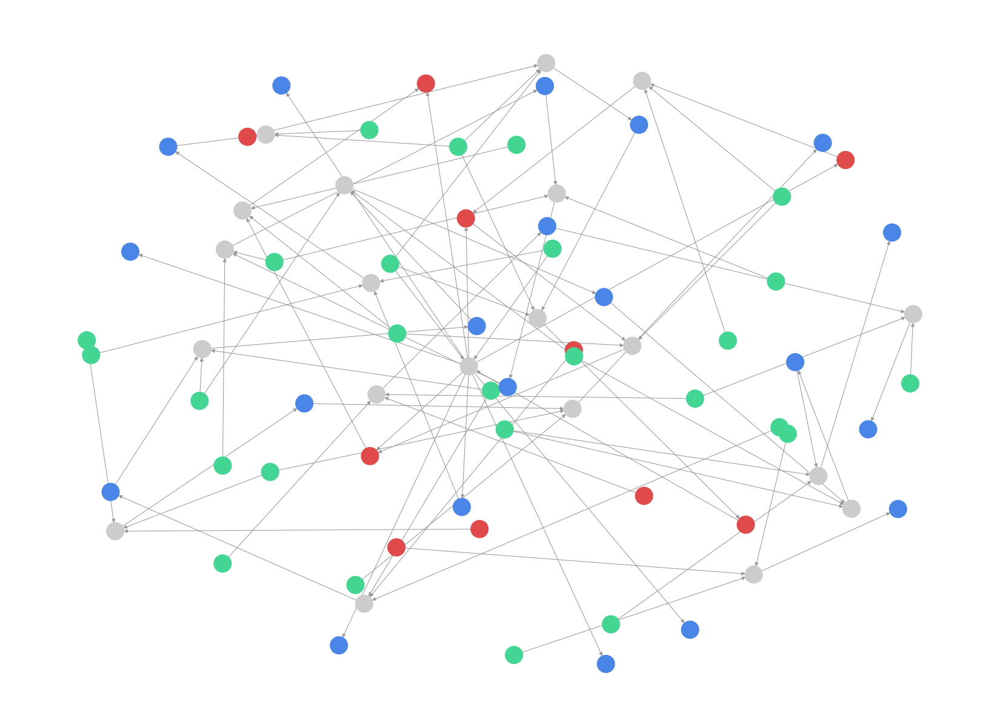

# btc-traffic-forensics

**AI-powered correlation of network-layer and blockchain-layer data to surface investigative leads from Bitcoin transaction traffic.**

Built for **SIH 2026 · SIH26146**, sponsored by the **National Technical Research Organisation (NTRO)** (Theme: Blockchain & Cybersecurity).

---

## Author

**Cheran N K** — B.Tech Electronics & Communication Engineering (Final Year), Puducherry Technological University
[github.com/cheran-eclipse](https://github.com/cheran-eclipse) · cheran.space@gmail.com


## Why this exists

Bitcoin's pseudonymous, peer-to-peer design lets illicit funds move, layer, and cash out — ransomware payoffs, darknet proceeds, extortion — while evading traditional financial surveillance. The official challenge is to build an **offline** system that ingests bulk transaction + network metadata, correlates the two layers, and applies a real trained model (not hand-written rules) to rank which wallets are worth an investigator's time — with an explanation attached, not just a score.

## What it does

1. **Ingests** the required schema: timestamp, src/dst IP and port, TXID, input/output wallet addresses and amounts, geo/ASN.
2. **Correlates** network and blockchain layers into a single graph — IPs, wallets, and transactions as nodes, so an investigator can trace a wallet back to the network activity that touched it.
3. **Detects** anomalies with an Isolation Forest over graph-derived features (fan-in, fan-out, geographic spread, transaction timing, peeling-chain signals) — a real model, not a rules engine dressed up as one.
4. **Explains** every flag in plain language: *"fed a transaction that split into 10 outputs — peeling-chain pattern"*, not just a bare confidence number.
5. **Visualizes** the result as a link-analysis graph.

## Nothing fancy. Just written code, proof exists.

Tested end-to-end against a synthetic sample with two deliberately planted patterns — a 10-way peeling chain and a wallet whose funds crossed 3 countries in under an hour — specifically so the detector's output could be checked against a known right answer before trusting it on anything real:

```
[FLAGGED] 1Btc1DXo9j5NavC        score=0.210  statistically unusual combination of fan-in/fan-out/geo features
[FLAGGED] 1McVt1vMtCC6iLHfMY     score=0.156  funds touched 3 different countries
[FLAGGED] 1FfmbHfnpaZjKFvyi1ok   score=0.138  fed a transaction that split into 10 outputs -- peeling-chain pattern
```


*Red = flagged wallets, blue = wallets, green = IPs, grey = transactions.*

### First-generation bug, worth noting

The first version of the fan-out feature measured a wallet's own out-degree in the graph — which turned out to be the wrong thing. A peeling chain is a property of the *transaction* (one input splitting into many new outputs), not an edge count on the input wallet itself. Caught this by checking the planted peeling-chain wallet against the output and seeing it wasn't flagged for the right reason. Fixed as a separate `max_tx_output_fanout` feature, re-ran, confirmed. Left in the README instead of quietly fixing it, because catching your own feature's blind spot before deployment is the actual skill, not writing the feature in the first place.

## Status — what's real vs. what's a stub

- [x] Schema ingestion, graph correlation, Isolation Forest model, explainable ranking, visualization — all working end-to-end on synthetic data
- [ ] Real NTRO-provided dataset swapped in (currently the bundled synthetic sample)
- [ ] GeoIP enrichment from an open-source database (currently reads geo columns already present in the data; the brief asks for these to be derived when absent)
- [ ] Interactive dashboard (currently a static image)
- [ ] Validation at a larger scale — 20 rows proves the pipeline runs, not that the anomaly thresholds are right

## BitGuard AI refinements — in progress

Methodology upgrades from a separate design document, built incrementally:

- **Labelled synthetic dataset generator** (`src/generate_dataset.py`) — plants
  known behaviour patterns (peeling chain, high velocity, rapid movement, amount
  splitting, layering, circular flow) and records a ground-truth label for every
  wallet. This is what lets later work *learn* risk weights from data instead of
  hand-picking them. It is a generator, not a detector. Committed output lives in
  `data/synthetic_transactions.csv` / `data/synthetic_labels.csv`; regenerate with:

  ```bash
  python src/generate_dataset.py --out-dir data --seed 7
  ```

- **Correlation confidence scoring** (`src/correlation_confidence.py`) — scores
  how confidently one network-layer observation maps to a candidate transaction
  (`0.5·time + 0.3·port + 0.2·ambiguity`). A match in a crowded time window scores
  lower; a weak match is returned `UNRESOLVED` rather than guessed. An accepted
  match is an *observation*, never a claim of wallet ownership.

  ```bash
  python src/correlation_confidence.py   # prints reference cases
  ```

  Wired into `build_graph` (Night 2): every `ip -> tx` edge now carries a
  `confidence` and an `ACCEPTED`/`UNRESOLVED` status.

- **Multi-hop features + learned risk weights** (Night 2) — `src/main.py` gained
  three path-level features (return-cycle hops, pass-through chain length,
  hold-time-before-forwarding) for the anomaly types local features couldn't
  see. `src/risk_model.py` fits a logistic regression from four evidence signals
  to the labelled data (spec 3c) and reports **Risk and Confidence as two
  separate numbers** (spec 3d). `src/diagnostics.py` measures per-pattern recall.

  ```bash
  python src/diagnostics.py     # per-anomaly-type recall
  python src/risk_model.py      # learned weights + risk/confidence table
  ```

- **Clustering, pattern heuristics, case files** (Night 3) — `src/clustering.py`
  runs DBSCAN over the same feature set and reports per-cluster purity (5
  clusters come out 100% anomalous; the mainstream blob 0%). `src/pattern_heuristics.py`
  emits the six laundering signals (fan-in, fan-out, rapid movement, amount
  splitting, layering, circular flow) as named supporting evidence — never a
  competing verdict. `src/case_file.py` assembles the investigative-lead record
  per entity (spec 3e): risk, confidence, why-flagged, supporting TXIDs, related
  entities, timeline, `IP → TXID → Wallet → Wallet` path.

  ```bash
  python src/clustering.py                 # cluster purity report
  python src/case_file.py --top 5          # investigative lead case files
  ```

The Streamlit dashboard and the offline end-to-end test are still to come (Night 4).

## Setup

```bash
pip install -r requirements.txt
python src/main.py --input data/sample_transactions.csv --top 10
```

Run the tests with `pip install -r requirements-dev.txt && python -m pytest`.

## License

MIT — see [LICENSE](LICENSE).
